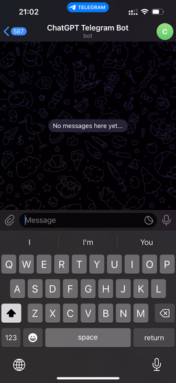

# ChatGPT Telegram Bot

This is a Node.js-based Telegram Bot application that leverages [OpenAI's API Key](https://platform.openai.com/account/api-keys) to interface with ChatGPT and retrieve responses. This bot is equipped with the following functionalities:

## ✨ Features
- Send a message to the Telegram bot and get a response from ChatGPT
- Retention of conversation history in memory via ChatGPT, providing continuity to previous discussion threads
- Option to reset conversation history by executing the `/reset` command for a new, refreshed interaction with ChatGPT.
- Telegram user IDs whitelist to prevent abuse (Optional)

## 👀 Demo

## 🧑🏻‍💻 Installation

1. Clone the repository
2. Run `yarn install`
3. Copy `.env.example` to `.env` and fill in the required values
4. Run `yarn start`

### Setting environment variables
| Environment variable  | Description |
| ------------- | ------------- |
| `TELEGRAM_TOKEN`  | Obtain a Telegram bot token from [BotFather](https://t.me/BotFather) using the `/newbot` command  |
| `CHATGPT_TOKEN`  | Obtain an OpenAI API Key from the [API Keys](https://platform.openai.com/account/api-keys) |
| `ONLY_ALLOW_WHITELISTED_TELEGRAM_IDS` | Set to `true` to only allow whitelisted Telegram IDs to use the bot |
| `WHITELISTED_TELEGRAM_IDS` | A comma-separated list of Telegram IDs to allow to use the bot. You can obtain user IDs by forwarding messages to [userinfobot](https://t.me/userinfobot) |

## 🐳 Deployment via Docker

1. You can build the Docker image for this project by running `docker build -t chatgpt-telegram-bot .`
2. During container deployment, set the environment variables as defined in the `.env.example` file.
